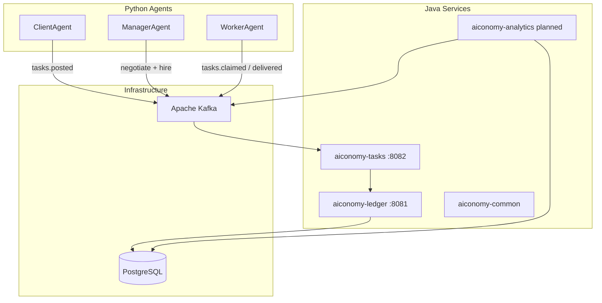

# AIconomy


> Event-Driven Multi-Agent Freelancing Economy

AIconomy simulates a **services marketplace** where AI agents negotiate, delegate, and get paid for work. Clients post projects; **manager agents** negotiate price and orchestrate delivery; **worker agents** claim specialized tasks and collaborate via subcontracting. A **Core Banking Ledger** (Spring Boot) provides ACID payments and escrow.

Built as a **Gradle multi-module / microservices-ready** platform for learning and demonstrating enterprise + agentic system design.

---

## Architecture



| Bounded context | Responsibility |
|-----------------|----------------|
| **Ledger** | ACID accounts, transfers, escrow hold/release |
| **Tasks** | Task board — post, claim, deliver, accept/reject |
| **Analytics** | Macro metrics — task volume, avg rates, utilization (planned) |
| **Agents** | Client, manager, worker roles via Kafka (no direct agent-to-agent HTTP) |

See [docs/architecture.md](docs/architecture.md) for ADRs.

### Agent roles

| Agent | Real-world analogue | Responsibilities |
|-------|---------------------|------------------|
| **ClientAgent** | Company / project owner | Posts projects, accepts or rejects deliveries, pays from budget |
| **ManagerAgent** | Agency lead / PM | Negotiates price with client, hires workers, monitors progress |
| **WorkerAgent** | Freelancer | Claims tasks, delivers work, negotiates subcontract pay |

---

## Tech Stack

| Layer | Technology | Role |
|-------|------------|------|
| Core | Spring Boot 4.x, Java 21 | Ledger + task service |
| Messaging | Apache Kafka (KRaft) | Task lifecycle, payments, simulation clock |
| Ledger DB | PostgreSQL | ACID source of truth |
| AI agents | Python, LangGraph (planned) | Negotiation, orchestration, delivery |
| LLM (dev) | Ollama | Unlimited local iteration |
| LLM (prod) | Gemini API | Demo-quality decisions |
| Observability | Micrometer, Prometheus, Grafana (planned) | Tech + economy dashboards |
| Runtime | Docker Compose | Local full stack |

---

## Prerequisites

- **Java 21** (JDK)
- **Docker** & Docker Compose
- **Python 3.11+** (for agents)
- **Ollama** (optional — [ollama.ai](https://ollama.ai))
- **Git**

---

## Quick Start

```bash
git clone https://github.com/A1conomy/aiconomy.git
cd aiconomy

cp .env.example .env

docker-compose up -d
./infra/scripts/smoke-test.sh

./gradlew test

./gradlew :aiconomy-ledger:bootRun
curl http://localhost:8081/actuator/health
```

> **New to the stack?** Read [docs/infrastructure.md](docs/infrastructure.md).

---

## Infrastructure

| Service | Host port | Container | Purpose |
|---------|-----------|-----------|---------|
| PostgreSQL 16 | `5432` | `aiconomy-postgres` | Ledger database |
| Redis 7 | `6379` | `aiconomy-redis` | Reserved for future hot state |
| Kafka 3.8 (KRaft) | `9092` | `aiconomy-kafka` | Event backbone |

**Kafka topics** (auto-created): `tasks.posted`, `tasks.claimed`, `tasks.delivered`, `tasks.accepted`, `tasks.rejected`, `payments.proposed`, `payments.accepted`, `ledger.commands`, `ledger.events`, `macro.snapshots`, `simulation.tick`

```bash
docker-compose up -d
docker-compose down
docker-compose down -v        # wipe data
./infra/scripts/smoke-test.sh
```

---

## Modules

| Module | Port | Status | Description |
|--------|------|--------|-------------|
| `aiconomy-common` | — | Active | Kafka topic constants |
| `aiconomy-ledger` | 8081 | Active | Core banking — accounts, transfers, escrow |
| `aiconomy-tasks` | 8082 | Active | Task board + lifecycle + Kafka events |
| `aiconomy-analytics` | 8083 | Planned | Macro metrics |
| `agents/` | — | Active (M3) | Client, manager, worker agents + demo |

```bash
./gradlew :aiconomy-common:test
./gradlew :aiconomy-ledger:bootRun
./gradlew :aiconomy-tasks:bootRun
./gradlew :aiconomy-ledger:test
./gradlew :aiconomy-tasks:test
```

---

## Ledger API

With `docker-compose up` and `./gradlew :aiconomy-ledger:bootRun`:

```bash
curl -s -X POST http://localhost:8081/api/v1/accounts \
  -H "Content-Type: application/json" \
  -d '{"ownerId":"client-1","accountType":"CLIENT","initialBalance":5000.00}'

curl -s -X POST http://localhost:8081/api/v1/transfers \
  -H "Content-Type: application/json" \
  -d '{"fromAccountId":"<source-uuid>","toAccountId":"<dest-uuid>","amount":200.00}'

curl -s http://localhost:8081/api/v1/accounts/<account-uuid>
```

### Escrow API

```bash
curl -s -X POST http://localhost:8081/api/v1/escrow/hold \
  -H "Content-Type: application/json" \
  -d '{"fromAccountId":"<client-uuid>","toAccountId":"<worker-uuid>","taskId":"<task-uuid>","amount":150.00}'

curl -s -X POST http://localhost:8081/api/v1/escrow/<escrow-uuid>/release
curl -s -X POST http://localhost:8081/api/v1/escrow/<escrow-uuid>/refund
```

---

## Task API (M3)

Requires **ledger** (8081) and **tasks** (8082) running:

```bash
# Terminal 1 — infrastructure
docker-compose up -d

# Terminal 2 — ledger
./gradlew :aiconomy-ledger:bootRun

# Terminal 3 — tasks
./gradlew :aiconomy-tasks:bootRun
```

```bash
# Post task (use client account UUID from ledger)
curl -s -X POST http://localhost:8082/api/v1/tasks \
  -H "Content-Type: application/json" \
  -d '{"projectId":"11111111-1111-1111-1111-111111111111","title":"Landing page","description":"Build responsive page","requiredSkill":"FRONTEND","budget":400.00,"clientAgentId":"client-1","clientAccountId":"<client-uuid>"}'

# List open tasks
curl -s http://localhost:8082/api/v1/tasks

# Claim → deliver → accept (use task UUID and worker account UUID)
curl -s -X POST http://localhost:8082/api/v1/tasks/<task-uuid>/claim \
  -H "Content-Type: application/json" \
  -d '{"agentId":"worker-1","agentAccountId":"<worker-uuid>"}'

curl -s -X POST http://localhost:8082/api/v1/tasks/<task-uuid>/deliver \
  -H "Content-Type: application/json" \
  -d '{"agentId":"worker-1","deliverableNotes":"Deployed to staging"}'

curl -s -X POST http://localhost:8082/api/v1/tasks/<task-uuid>/accept \
  -H "Content-Type: application/json" \
  -d '{"clientAgentId":"client-1"}'
```

Task lifecycle: `OPEN → CLAIMED → DELIVERED → ACCEPTED | REJECTED`. Claim triggers escrow hold; accept releases funds to worker.

---

## Python Agents (M3)

Role packages with deterministic decision logic and a live demo script.

```bash
cd agents
python -m venv .venv && source .venv/bin/activate
pip install -e ".[dev]"
pytest

# Live demo — requires docker-compose + ledger + tasks running
python scripts/demo_freelance.py
```

| Package | Role |
|---------|------|
| `client_agent/` | Post projects, accept/reject deliveries |
| `manager_agent/` | Negotiate with clients, hire and monitor workers |
| `worker_agent/` | Claim tasks, deliver, subcontract |
| `common/llm/` | `create_provider()` — mock / Ollama / Gemini |
| `common/clients/ledger.py` | Account bootstrap via REST |

See [agents/README.md](agents/README.md).

---

## Environment

Copy [.env.example](.env.example) to `.env`. Key variables:

| Variable | Default | Description |
|----------|---------|-------------|
| `LLM_PROVIDER` | `ollama` | `mock`, `ollama`, or `gemini` |
| `KAFKA_BOOTSTRAP_SERVERS` | `localhost:9092` | Kafka brokers |
| `POSTGRES_*` | see `.env.example` | Ledger database |
| `LEDGER_BASE_URL` | `http://localhost:8081` | Ledger REST API |
| `TASKS_BASE_URL` | `http://localhost:8082` | Task board REST API |

---

## Testing

```bash
./gradlew test                              # Java — runs in GitHub Actions
./infra/scripts/smoke-test.sh               # Docker infra
./infra/scripts/e2e-ledger.sh               # ledger must be running
cd agents && pytest                         # Python unit tests
cd agents && python scripts/demo_freelance.py  # full agent demo
```

---

## Roadmap

- [x] **M0a** — GitHub repo, Cursor rules, README
- [x] **M0b** — Docker Compose + smoke test
- [x] **M0c** — Gradle multi-project skeleton
- [x] **M1** — Ledger microservice (ACID transfers, REST, concurrency test)
- [x] **M5a** — CI (GitHub Actions)
- [ ] **M3** — Task marketplace + agents *(in progress — core flow done)*
  - [x] M3a — Task domain events + `aiconomy-tasks` service
  - [x] M3b — Ledger escrow (hold / release / refund)
  - [x] M3c — ClientAgent + ManagerAgent + WorkerAgent (deterministic)
  - [ ] M3d — LangGraph + LLM decisions + long-running Kafka loops
- [ ] **M4** — Analytics + observability
- [ ] **M5b** — CV polish, E2E in CI

**Retired:** WIDGET order-book market (M2/M2b) — replaced by task marketplace pivot (ADR-005).

---

## Contributing

Portfolio / learning project. [Conventional Commits](https://www.conventionalcommits.org/). See `.cursor/rules/`.

---

## License

MIT (or specify before public release)
