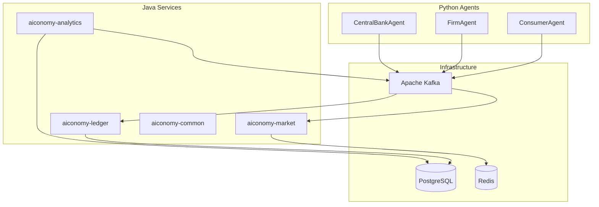

# AIconomy

> Event-Driven Agent-Based Macroeconomic Simulation Platform

AIconomy simulates an autonomous economy where AI agents (consumers, firms, central bank) make financial decisions in a distributed, event-driven system. A **Core Banking Ledger** guarantees ACID fund transfers; an **Open Market Matching Engine** matches buy/sell orders in real time; **Python/LangGraph agents** act autonomously based on macroeconomic state.

Built as a **Gradle multi-module / microservices-ready** platform for learning and demonstrating enterprise system design.

---

## Architecture



| Bounded context | Responsibility |
|-----------------|----------------|
| **Ledger** | Central bank, double-entry bookkeeping, ACID transfers |
| **Market** | Order book, price-time matching, trade events |
| **Analytics** | Macro metrics (GDP, inflation, credit volume) |
| **Agents** | Autonomous AI actors via Kafka (no direct agent-to-agent calls) |

See [docs/architecture.md](docs/architecture.md) for ADRs.

---

## Tech Stack

| Layer | Technology | Role |
|-------|------------|------|
| Core | Spring Boot 4.x, Java 21 | Banking & market services |
| Messaging | Apache Kafka (KRaft) | Event backbone, audit, replay |
| Ledger DB | PostgreSQL | ACID source of truth |
| Order book | Redis | Hot in-memory matching state |
| AI agents | Python, LangGraph | Autonomous market participants |
| LLM (dev) | Ollama | Unlimited local iteration |
| LLM (prod) | Gemini API | Demo-quality decisions |
| Observability | Micrometer, Prometheus, Grafana | Tech + macro dashboards |
| Runtime | Docker Compose | Local full stack |

---

## Prerequisites

- **Java 21** (JDK)
- **Docker** & Docker Compose
- **Python 3.11+** (for agents, Milestone 3)
- **Ollama** (optional, for local LLM — [ollama.ai](https://ollama.ai))
- **Git**

---

## Quick Start

> Infrastructure and services are added incrementally. See Roadmap below.

```bash
# Clone
git clone https://github.com/AIconomy/aiconomy.git
cd aiconomy

# Copy environment template
cp .env.example .env

# Run tests (Spring scaffold)
./gradlew test

# Docker stack — available from Milestone 0b
# docker compose up -d
```

---

## Modules

| Module | Port | Status | Description |
|--------|------|--------|-------------|
| `aiconomy-common` | — | Planned | Shared events & DTOs |
| `aiconomy-ledger` | 8081 | Planned | Core banking ledger |
| `aiconomy-market` | 8082 | Planned | Matching engine |
| `aiconomy-analytics` | 8083 | Planned | Macro metrics |
| `agents/` | — | Planned | Python LangGraph agents |

---

## Environment Variables

Copy [.env.example](.env.example) to `.env`. Key variables:

| Variable | Default | Description |
|----------|---------|-------------|
| `LLM_PROVIDER` | `ollama` | `ollama` or `gemini` |
| `KAFKA_BOOTSTRAP_SERVERS` | `localhost:9092` | Kafka brokers |
| `POSTGRES_*` | see `.env.example` | Ledger database |
| `REDIS_HOST` | `localhost` | Order book cache |

---

## Testing

```bash
# Java (all modules)
./gradlew test

# Python agents (Milestone 3)
cd agents && pytest
```

---

## Roadmap

- [x] **M0a** — GitHub repo, Cursor rules, README, `.gitignore`
- [ ] **M0b** — Docker Compose (Postgres, Kafka, Redis)
- [ ] **M0c** — Gradle multi-project skeleton + Testcontainers
- [ ] **M1** — Ledger microservice (ACID transfers)
- [ ] **M2** — Market matching engine
- [ ] **M3** — Python agents (Ollama/Gemini)
- [ ] **M4** — Observability (Prometheus/Grafana)
- [ ] **M5** — CI, E2E, CV polish

---

## Contributing

This is a portfolio / learning project. Commits follow [Conventional Commits](https://www.conventionalcommits.org/). See `.cursor/rules/` for coding standards.

---

## License

MIT (or specify before public release)
