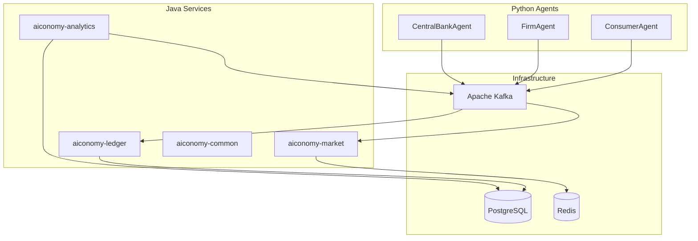

# AIconomy

> Event-Driven Agent-Based Macroeconomic Simulation Platform

AIconomy simulates an autonomous economy where AI agents (consumers, firms, central bank) make financial decisions in a distributed, event-driven system. A **Core Banking Ledger** guarantees ACID fund transfers; an **Open Market Matching Engine** matches buy/sell orders in real time; **Python/LangGraph agents** act autonomously based on macroeconomic state.

Built as a **Gradle multi-module / microservices-ready** platform for learning and demonstrating enterprise system design.

---

## Architecture



| Bounded context | Responsibility |
|-----------------|----------------|
| **Ledger** | Central bank, double-entry bookkeeping, ACID transfers |
| **Market** | Order book, price-time matching, trade events |
| **Analytics** | Macro metrics (GDP, inflation, credit volume) |
| **Agents** | Autonomous AI actors via Kafka (no direct agent-to-agent calls) |

See [docs/architecture.md](docs/architecture.md) for ADRs.

---

## Tech Stack

| Layer | Technology | Role |
|-------|------------|------|
| Core | Spring Boot 4.x, Java 21 | Banking & market services |
| Messaging | Apache Kafka (KRaft) | Event backbone, audit, replay |
| Ledger DB | PostgreSQL | ACID source of truth |
| Order book | Redis | Hot in-memory matching state |
| AI agents | Python, LangGraph | Autonomous market participants |
| LLM (dev) | Ollama | Unlimited local iteration |
| LLM (prod) | Gemini API | Demo-quality decisions |
| Observability | Micrometer, Prometheus, Grafana | Tech + macro dashboards |
| Runtime | Docker Compose | Local full stack |

---

## Prerequisites

- **Java 21** (JDK)
- **Docker** & Docker Compose
- **Python 3.11+** (for agents, Milestone 3)
- **Ollama** (optional, for local LLM — [ollama.ai](https://ollama.ai))
- **Git**

---

## Quick Start

```bash
# Clone
git clone https://github.com/A1conomy/aiconomy.git
cd aiconomy

# Environment (optional — defaults match docker-compose)
cp .env.example .env

# Start infrastructure (Postgres, Kafka, Redis)
docker-compose up -d

# Verify all services healthy
./infra/scripts/smoke-test.sh

# Run Spring tests
./gradlew test

# Run ledger service (requires docker-compose up)
./gradlew :aiconomy-ledger:bootRun

# Run market service (requires docker-compose up)
./gradlew :aiconomy-market:bootRun

# Health check (ledger on port 8081, market on port 8082)
curl http://localhost:8081/actuator/health
curl http://localhost:8082/actuator/health
```

> **New to the stack?** Read [docs/infrastructure.md](docs/infrastructure.md) — explains Docker, Kafka, Postgres, Redis in AIconomy context.

---

## Infrastructure (M0b)

| Service | Host port | Container | Purpose |
|---------|-----------|-----------|---------|
| PostgreSQL 16 | `5432` | `aiconomy-postgres` | ACID ledger database |
| Redis 7 | `6379` | `aiconomy-redis` | Order book (M2) |
| Kafka 3.8 (KRaft) | `9092` | `aiconomy-kafka` | Event backbone |

**Kafka topics** (auto-created): `orders.submitted`, `trades.executed`, `ledger.commands`, `ledger.events`, `market.quotes`, `macro.snapshots`, `simulation.tick`

```bash
docker-compose up -d          # start
docker-compose down           # stop
docker-compose down -v        # stop + wipe data
./infra/scripts/smoke-test.sh # health check
```

---

## Modules

| Module | Port | Status | Description |
|--------|------|--------|-------------|
| `aiconomy-common` | — | Active | Shared Kafka topic constants & DTOs |
| `aiconomy-ledger` | 8081 | Active | Core banking ledger (accounts, ACID transfers) |
| `aiconomy-market` | 8082 | Active (skeleton) | Matching engine — Redis order book + Kafka |
| `aiconomy-analytics` | 8083 | Planned | Macro metrics |
| `agents/` | — | Planned | Python LangGraph agents |

```bash
./gradlew :aiconomy-common:test     # common module only
./gradlew :aiconomy-ledger:bootRun # run ledger service
./gradlew :aiconomy-ledger:test     # ledger tests (Testcontainers needs Docker)
./gradlew :aiconomy-market:bootRun # run market service
./gradlew :aiconomy-market:test     # market tests
```

---

## Ledger API (M1)

With `docker-compose up` and `./gradlew :aiconomy-ledger:bootRun`:

```bash
# Create account
curl -s -X POST http://localhost:8081/api/v1/accounts \
  -H "Content-Type: application/json" \
  -d '{"ownerId":"agent-1","accountType":"CONSUMER","initialBalance":1000.00}'

# Transfer (use account IDs from create response)
curl -s -X POST http://localhost:8081/api/v1/transfers \
  -H "Content-Type: application/json" \
  -d '{"fromAccountId":"<source-uuid>","toAccountId":"<dest-uuid>","amount":50.00}'

# Get balance
curl -s http://localhost:8081/api/v1/accounts/<account-uuid>
```

---

Copy [.env.example](.env.example) to `.env`. Key variables:

| Variable | Default | Description |
|----------|---------|-------------|
| `LLM_PROVIDER` | `ollama` | `ollama` or `gemini` |
| `KAFKA_BOOTSTRAP_SERVERS` | `localhost:9092` | Kafka brokers |
| `POSTGRES_*` | see `.env.example` | Ledger database |
| `REDIS_HOST` | `localhost` | Order book cache |

---

## Testing

```bash
# Java (all modules)
./gradlew test

# Python agents (Milestone 3)
cd agents && pytest
```

---

## Roadmap

- [x] **M0a** — GitHub repo, Cursor rules, README, `.gitignore`
- [x] **M0b** — Docker Compose (Postgres, Kafka, Redis) + smoke test
- [x] **M0c** — Gradle multi-project skeleton + Spring infra connectivity
- [x] **M1** — Ledger microservice (ACID transfers, REST API, concurrency test)
- [ ] **M2** — Market matching engine *(in progress — module skeleton)*
- [ ] **M3** — Python agents (Ollama/Gemini)
- [ ] **M4** — Observability (Prometheus/Grafana)
- [ ] **M5** — CI, E2E, CV polish

---

## Contributing

This is a portfolio / learning project. Commits follow [Conventional Commits](https://www.conventionalcommits.org/). See `.cursor/rules/` for coding standards.

---

## License

MIT (or specify before public release)
