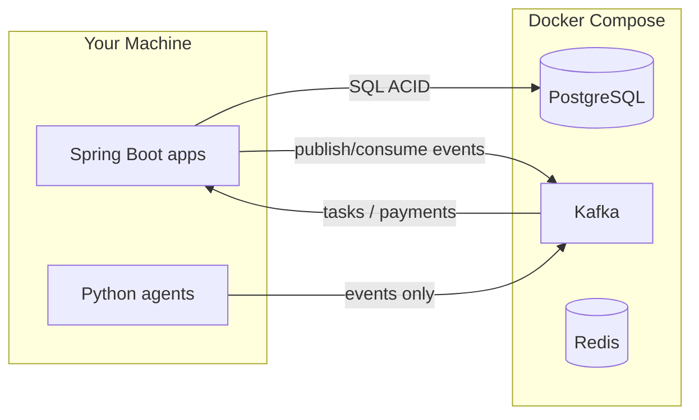

# Infrastructure Guide — How It Works in AIconomy

This document explains Docker, PostgreSQL, Kafka, and Redis in the context of our project.

---

## The Big Picture

Think of AIconomy as a **freelancing economy platform**:

| Real world | AIconomy component | Tool |
|------------|-------------------|------|
| Bank vault & accounting books | Core Banking Ledger | **PostgreSQL** |
| Job board announcements | Event messaging | **Kafka** |
| Fast session/cache state (future) | Hot projections | **Redis** |
| City itself (where everything runs) | Local runtime | **Docker Compose** |

Services (Spring Boot, Python agents) are **tenants in the city**. Agents don't call each other over HTTP — they use Kafka. The ledger is the only HTTP dependency for payments.



---

## Docker Compose — Why?

**Problem:** Installing Postgres, Kafka, and Redis natively on your OS is painful (versions, configs, cleanup).

**Solution:** Docker runs each tool in an **isolated container**. Docker Compose starts all of them with one command:

```bash
docker-compose up -d      # start
docker-compose down       # stop
docker-compose down -v    # stop + delete data
```

**In our project:**
- `docker-compose.yml` defines 4 services: `postgres`, `redis`, `kafka`, `kafka-init`
- Spring apps run **on your host** (not in Docker yet) and connect via `localhost:5432`, `localhost:9092`, `localhost:6379`
- Data persists in Docker volumes until you run `down -v`

---

## PostgreSQL — The Ledger (Source of Truth)

**Role:** Stores accounts, balances, and every ledger entry. **ACID transactions** guarantee money never disappears or duplicates.

**Why Postgres (not Redis/Mongo)?**
- Strong consistency — critical for banking
- Row-level locking — prevents race conditions when many agents transfer money simultaneously
- `NUMERIC` type maps cleanly to Java `BigDecimal`

**What we store (M1):**
```
accounts          → id, owner, balance, version (optimistic lock)
```

Escrow holds and task records will extend this in M3.

**Spring connection:**
```properties
spring.datasource.url=jdbc:postgresql://localhost:5432/aiconomy
```

**Analogy:** The bank's official ledger book. If it's not in Postgres, it didn't happen.

---

## Kafka — The Event Backbone

**Role:** Async message bus. Services **publish events**; other services **subscribe** and react. No direct HTTP calls between agents.

### Core concepts (refresh)

| Concept | Meaning | AIconomy example |
|---------|---------|------------------|
| **Topic** | Named channel for one event type | `tasks.posted` |
| **Producer** | Sends messages to a topic | ClientAgent posts a project |
| **Consumer** | Reads messages from a topic | Task service consumes new tasks |
| **Partition** | Parallel sub-stream within a topic | 3 partitions = 3 concurrent consumers |
| **Offset** | Position in the log | Lets consumers resume after restart |
| **Broker** | Kafka server | Our `aiconomy-kafka` container |

### Our topics (pre-created by `kafka-init`)

| Topic | Publisher | Consumer | Payload |
|-------|-----------|----------|---------|
| `tasks.posted` | ClientAgent | Task service, workers | New project/task |
| `tasks.claimed` | Worker/Manager | Task service | Task assignment |
| `tasks.delivered` | Worker | Client, Manager | Delivery submitted |
| `tasks.accepted` | ClientAgent | Ledger, Analytics | Approval |
| `tasks.rejected` | ClientAgent | Ledger, workers | Rejection |
| `payments.proposed` | Any agent | Counterparty | Price negotiation |
| `payments.accepted` | Counterparty | Ledger | Agreed payment |
| `ledger.commands` | Task service | Ledger | Transfer/escrow commands |
| `ledger.events` | Ledger | Agents, Analytics | Balance updates |
| `macro.snapshots` | Analytics | Agents | Economy metrics |
| `simulation.tick` | Scheduler | All agents | Simulation clock |

### Why Kafka (not REST between services)?

1. **Decoupling** — Agents don't need to know each other's endpoints
2. **Durability** — Events survive crashes; replay simulation from offset 0
3. **Scale** — Many agents publishing without overwhelming one HTTP server
4. **Audit trail** — Every economic action is logged

**Analogy:** A newspaper that never throws away old editions. Everyone reads the same feed.

### KRaft mode

Older Kafka needed Zookeeper (extra complexity). We use **KRaft** — Kafka manages its own metadata. One less container.

---

## Redis — Reserved for Hot State

**Role:** In-memory store for fast projections (optional in current baseline).

Redis remains in Docker Compose for future use (task queue cache, idempotency keys, rate limits). The retired WIDGET order book used Redis; the task marketplace will likely use Postgres first, Redis only if needed for hot paths.

---

## End-to-End Flow (Target — M3)

Example: Client posts a project; manager hires a worker.

```
1. ClientAgent → Kafka: tasks.posted {project, budget}
2. ManagerAgent consumes → negotiates price with client via payments.proposed
3. WorkerAgent → Kafka: tasks.claimed {taskId}
4. Ledger → escrow hold on agreed amount
5. WorkerAgent → Kafka: tasks.delivered {deliverable}
6. ClientAgent → Kafka: tasks.accepted
7. Ledger → release escrow to worker (+ manager fee split)
8. Analytics → macro.snapshots {task volume, avg rate}
```

---

## Useful Commands

```bash
docker-compose up -d
docker-compose down
./infra/scripts/smoke-test.sh

docker-compose exec postgres psql -U aiconomy -d aiconomy
docker-compose exec redis redis-cli

docker-compose exec kafka /opt/kafka/bin/kafka-topics.sh \
  --bootstrap-server localhost:29092 --list

docker-compose exec kafka /opt/kafka/bin/kafka-console-consumer.sh \
  --bootstrap-server localhost:29092 --topic tasks.posted --from-beginning
```

---

## Troubleshooting

| Problem | Fix |
|---------|-----|
| Port 5432/6379/9092 already in use | Stop local Postgres/Redis or change ports in `.env` |
| Kafka not ready | Wait 30–40s after `up -d`; check `docker-compose logs kafka` |
| Topics missing | Re-run init: `docker-compose up kafka-init` |
| Reset everything | `docker-compose down -v && docker-compose up -d` |
