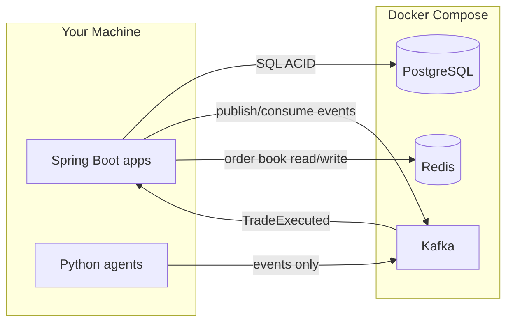

# Infrastructure Guide — How It Works in AIconomy

This document explains Docker, PostgreSQL, Kafka, and Redis in the context of our project.

---

## The Big Picture

Think of AIconomy as a **mini city economy**:

| Real world | AIconomy component | Tool |
|------------|-------------------|------|
| Bank vault & accounting books | Core Banking Ledger | **PostgreSQL** |
| Newspaper / radio (announcements) | Event messaging | **Kafka** |
| Stock exchange trading floor (live prices) | Order book | **Redis** |
| City itself (where everything runs) | Local runtime | **Docker Compose** |

Services (Spring Boot, Python agents) are **tenants in the city**. They don't talk directly to each other — they use Kafka and shared databases.



---

## Docker Compose — Why?

**Problem:** Installing Postgres, Kafka, and Redis natively on your OS is painful (versions, configs, cleanup).

**Solution:** Docker runs each tool in an **isolated container**. Docker Compose starts all of them with one command:

```bash
docker-compose up -d      # start
docker-compose down       # stop
docker-compose down -v    # stop + delete data
```

**In our project:**
- `docker-compose.yml` defines 4 services: `postgres`, `redis`, `kafka`, `kafka-init`
- Spring apps run **on your host** (not in Docker yet) and connect via `localhost:5432`, `localhost:9092`, `localhost:6379`
- Data persists in Docker volumes until you run `down -v`

---

## PostgreSQL — The Ledger (Source of Truth)

**Role:** Stores accounts, balances, and every ledger entry. **ACID transactions** guarantee money never disappears or duplicates.

**Why Postgres (not Redis/Mongo)?**
- Strong consistency — critical for banking
- Row-level locking — prevents race conditions when 50 AI agents transfer money simultaneously
- `NUMERIC` type maps cleanly to Java `BigDecimal`

**What we'll store (M1):**
```
accounts          → id, owner, balance, version (optimistic lock)
ledger_entries    → debit account, credit account, amount, timestamp
loans             → borrower, principal, interest rate
```

**Spring connection:**
```properties
spring.datasource.url=jdbc:postgresql://localhost:5432/aiconomy
```

**Analogy:** The bank's official ledger book. If it's not in Postgres, it didn't happen.

---

## Kafka — The Event Backbone

**Role:** Async message bus. Services **publish events**; other services **subscribe** and react. No direct HTTP calls between agents.

### Core concepts (refresh)

| Concept | Meaning | AIconomy example |
|---------|---------|------------------|
| **Topic** | Named channel for one event type | `orders.submitted` |
| **Producer** | Sends messages to a topic | Python Firm agent publishes a buy order |
| **Consumer** | Reads messages from a topic | Market service consumes orders |
| **Partition** | Parallel sub-stream within a topic | 3 partitions = 3 concurrent consumers |
| **Offset** | Position in the log | Lets consumers resume after restart |
| **Broker** | Kafka server | Our `aiconomy-kafka` container |

### Our topics (pre-created by `kafka-init`)

| Topic | Publisher | Consumer | Payload |
|-------|-----------|----------|---------|
| `orders.submitted` | Agents | Market | Buy/sell intent |
| `trades.executed` | Market | Ledger | Matched trade details |
| `ledger.commands` | Market, Agents | Ledger | Transfer/settle commands |
| `ledger.events` | Ledger | Agents, Analytics | Balance updates |
| `market.quotes` | Market | Agents | Current prices |
| `macro.snapshots` | Analytics | Agents, Central Bank | GDP, inflation |
| `simulation.tick` | Scheduler | All agents | "Next day" signal |

### Why Kafka (not REST between services)?

1. **Decoupling** — Agent doesn't need to know Market's URL
2. **Durability** — Events survive crashes; replay simulation from offset 0
3. **Scale** — Hundreds of agents publishing without overwhelming one HTTP server
4. **Audit trail** — Every economic action is logged

**Analogy:** A newspaper that never throws away old editions. Everyone reads the same feed.

### KRaft mode

Older Kafka needed Zookeeper (extra complexity). We use **KRaft** — Kafka manages its own metadata. One less container.

---

## Redis — The Hot Order Book

**Role:** In-memory store for **live market state** that changes every millisecond.

**Why Redis (when we already have Kafka)?**

| | Kafka | Redis |
|---|-------|-------|
| Speed | ms–s (disk log) | sub-ms (RAM) |
| Data model | Append-only log | Key-value, sorted sets |
| Best for | Events, audit, replay | Current state, rankings |

**What we'll store (M2):**
```
orderbook:GOODS:bids    → sorted set (price → order JSON)
orderbook:GOODS:asks    → sorted set
market:last_price:GOODS → string
```

Matching engine reads top bid + top ask from Redis, matches if prices cross, then publishes `TradeExecuted` to Kafka → Ledger settles in Postgres.

**Analogy:** The trading screen showing live prices. Kafka is the recording of every trade; Redis is what's on the screen right now.

---

## End-to-End Flow (Future — M2/M3)

Example: Consumer agent buys goods from a firm.

```
1. Consumer agent → Kafka: orders.submitted {buy 10 units @ 5.00}
2. Market service consumes → matches in Redis order book
3. Market service → Kafka: trades.executed {buyer, seller, price, qty}
4. Ledger service consumes → Postgres ACID transfer (buyer -50, seller +50)
5. Ledger service → Kafka: ledger.events {new balances}
6. Analytics consumes → updates GDP metric
7. Agents consume market.quotes + ledger.events → next decision
```

---

## Connecting from Spring Boot (M0c preview)

```yaml
# application-docker.yml (coming in M0c)
spring:
  datasource:
    url: jdbc:postgresql://localhost:5432/aiconomy
    username: aiconomy
    password: change-me
  kafka:
    bootstrap-servers: localhost:9092
  data:
    redis:
      host: localhost
      port: 6379
```

---

## Useful Commands

```bash
# Start / stop
docker-compose up -d
docker-compose down

# Verify everything works
./infra/scripts/smoke-test.sh

# Postgres shell
docker-compose exec postgres psql -U aiconomy -d aiconomy

# Redis shell
docker-compose exec redis redis-cli

# List Kafka topics
docker-compose exec kafka /opt/kafka/bin/kafka-topics.sh \
  --bootstrap-server localhost:29092 --list

# Watch live events (debug)
docker-compose exec kafka /opt/kafka/bin/kafka-console-consumer.sh \
  --bootstrap-server localhost:29092 --topic orders.submitted --from-beginning
```

---

## Troubleshooting

| Problem | Fix |
|---------|-----|
| Port 5432/6379/9092 already in use | Stop local Postgres/Redis or change ports in `.env` |
| Kafka not ready | Wait 30–40s after `up -d`; check `docker-compose logs kafka` |
| Topics missing | Re-run init: `docker-compose up kafka-init` |
| Reset everything | `docker-compose down -v && docker-compose up -d` |
